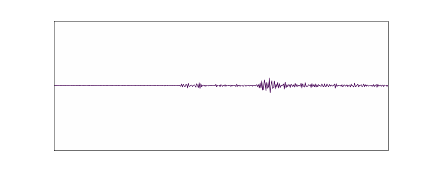

# Quentin Higueret 🌍🔍

## 👋 About Me
I'm a PhD student in seismology at ISTerre, Grenoble, focusing on microseismicity detection, ambient noise seismology, and fault dynamics. 
I use dense seismic arrays and machine learning to analyze and monitor earthquake processes.

## 📈 Key Projects
- 🌐**Faultscan Array**: Advanced microseismicity and tremor detection.
- 🔬**Ambient Noise Monitoring**: Body-wave correlations for fault-zone monitoring.
- 📊 **Technical Skills**: Python, ObsPy, SciPy, Pandas, GIS.

## 📫 Contact
- **Email**: [quentin.higueret@univ-grenoble-alpes.fr](mailto:quentin.higueret@univ-grenoble-alpes.fr)
- **GitHub**: [github.com/quentinhigueret](https://github.com/Qhig)
