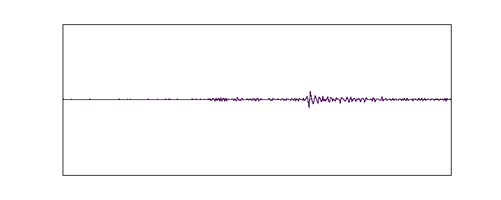

# Quentin Higueret 🌍🔍

## 👋 About Me
I’m a PhD student in seismology at ISTerre, Grenoble, focusing on understanding fault dynamics, from uncovering seismicity patterns to exploring exotic signal manifestations. 
I use dense seismic arrays, combined with both traditional seismic analysis and machine learning techniques, to study and monitor earthquake processes.

## 📈 Key Projects
- 🌐**Faultscan Array**: Advanced microseismicity, tremor detection and body-wave correlations for fault-zone monitoring.
## 📊 Technical Skills
 
 
 

## 🧩 Ponder This Challenge
Each month, I participate in IBM's **Ponder This** challenge, tackling complex coding puzzles to sharpen my problem-solving and algorithmic skills.

## 📫 Contact
- **Email**: [quentin.higueret@univ-grenoble-alpes.fr](mailto:quentin.higueret@univ-grenoble-alpes.fr)
- **Website**: 
- **GitHub**: [github.com/quentinhigueret](https://github.com/Qhig)
